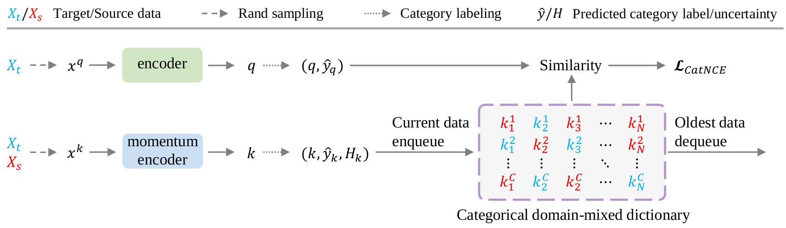

# Category Contrast for Unsupervised Domain Adaptation in Visual Tasks


## Paper

[Category Contrast for Unsupervised Domain Adaptation in Visual Tasks](xxxx)  
 [Jiaxing Huang](https://scholar.google.com/citations?user=czirNcwAAAAJ&hl=en&oi=ao), [Dayan Guan](https://scholar.google.com/citations?user=9jp9QAsAAAAJ&hl=en), [Xiao Aoran](https://scholar.google.com/citations?user=yGKsEpAAAAAJ&hl=en), [Shijian Lu](https://scholar.google.com/citations?user=uYmK-A0AAAAJ&hl=en), [Ling Shao](https://scholar.google.com/citations?user=z84rLjoAAAAJ&hl=en)  
 School of Computer Science Engineering, Nanyang Technological University, Singapore  
IEEE Conference on Computer Vision and Pattern Recognition, CVPR 2022.
 
If you find this code/paper useful for your research, please cite our [paper](xxx):

```
@inproceedings{huang2022category,
  title={Category Contrast for Unsupervised Domain Adaptation in Visual Tasks},
  author={Huang, Jiaxing and Guan, Dayan and Xiao, Aoran and Lu, Shijian and Shao, Ling},
  booktitle={IEEE Conference on Computer Vision and Pattern Recognition},
  year={2022}
}

```

## Installation
1. Conda enviroment:
```bash
conda create -n caco python=3.6
conda activate caco
conda install -c menpo opencv
pip install torch==1.0.0 torchvision==0.2.1
```

2. Clone the [ADVENT](https://github.com/valeoai/ADVENT):
```bash
git clone https://github.com/valeoai/ADVENT.git
pip install -e ./ADVENT
```

3. Clone the repo:
```bash
https://github.com/jxhuang0508/CaCo.git
pip install -e ./CaCo
```

4. Install environment:
```bash
conda env create -f ./caco_proda_finetune/caco_pro_ft.yml
conda env create -f ./caco_vanilla_finetune/caco_van.yml
```

### Prepare Dataset
* **GTA5**: Please follow the instructions [here](https://download.visinf.tu-darmstadt.de/data/from_games/) to download images and semantic segmentation annotations. The GTA5 dataset directory should have this basic structure:
```bash
CaCo/data/GTA5/                               % GTA dataset root
CaCo/data/GTA5/images/                        % GTA images
CaCo/data/GTA5/labels/                        % Semantic segmentation labels
...
```

* **Cityscapes**: Please follow the instructions in [Cityscape](https://www.cityscapes-dataset.com/) to download the images and validation ground-truths. The Cityscapes dataset directory should have this basic structure:
```bash
CaCo/data/Cityscapes/                         % Cityscapes dataset root
CaCo/data/Cityscapes/leftImg8bit              % Cityscapes images
CaCo/data/Cityscapes/leftImg8bit/val
CaCo/data/Cityscapes/gtFine                   % Semantic segmentation labels
CaCo/data/Cityscapes/gtFine/val
...
```

### Pre-trained models
Pre-trained models can be downloaded [here](https://github.com/jxhuang0508/CaCo/releases/tag/Pre-train) and put ```DeepLab_resnet_pretrained_imagenet.pth``` and ```gta_source_only_pretrained.pth``` into ```CaCo/pretrained_models```, and ```caco_stage1.pth``` into ```CaCo/caco_vanilla_finetune/snapshots/caco_stage1```. 

### Training
To train CaCo + ProDA (~58 mIoU):
```bash
# step 1: train CaCo warmup
conda activate caco
cd CaCo/caco/scripts
# train
python train_caco.py --cfg configs/CaCo.yml
# test
python test.py --cfg configs/CaCo.yml
```
```bash
# step 2: generate pseudo labels to transfer to ProDA
conda activate caco_van
cd CaCo/caco_vanilla_finetune
python generate_plabel_cityscapes_advent_caco.py  --restore-from ./snapshots/caco_stage1/caco_stage1.pth

# Step 3: manually copy the caco-generated pseudo labels into ``CaCo/caco_proda_finetune/Pseudo/train_all```.
```
```bash
# Step 4: train CaCo + Proda:
conda activate caco_pro_ft
cd CaCo/caco_proda_finetune
# Stage 0: restore CaCo network with generated pseudo labels by warm up  
python train.py --name gta2citylabv2_warmup --stage warm_up --freeze_bn --gan LS --lr 2.5e-4 --adv 0.01 --no_resume --used_save_pseudo --path_LP ./Pseudo/train_all
# Stage 1:  
python generate_pseudo_label.py --name gta2citylabv2_warmup_soft --soft --resume_path ./logs/gta2citylabv2_warmup/from_gta5_to_cityscapes_on_deeplabv2_best_model.pkl --no_droplast  
python calc_prototype.py --resume_path ./logs/gta2citylabv2_warmup/from_gta5_to_cityscapes_on_deeplabv2_best_model.pkl  
python train.py --name gta2citylabv2_stage1Denoise --used_save_pseudo --ema --proto_rectify --moving_prototype --path_soft Pseudo/gta2citylabv2_warmup_soft --resume_path ./logs/gta2citylabv2_warmup/from_gta5_to_cityscapes_on_deeplabv2_best_model.pkl --proto_consistW 10 --rce --regular_w 0.1
# Stage 2:  
python generate_pseudo_label.py --name gta2citylabv2_stage1Denoise --flip --resume_path ./logs/gta2citylabv2_stage1Denoise/from_gta5_to_cityscapes_on_deeplabv2_best_model.pkl --no_droplast  
python train.py --name gta2citylabv2_stage2 --stage stage2 --used_save_pseudo --path_LP Pseudo/gta2citylabv2_stage1Denoise --resume_path ./logs/gta2citylabv2_stage1Denoise/from_gta5_to_cityscapes_on_deeplabv2_best_model.pkl --S_pseudo 1 --threshold 0.95 --distillation 1 --finetune --lr 6e-4 --student_init simclr --bn_clr --no_resume  
# Stage 3:  
python generate_pseudo_label.py --name gta2citylabv2_stage2 --flip --resume_path ./logs/gta2citylabv2_stage2/from_gta5_to_cityscapes_on_deeplabv2_best_model.pkl --no_droplast --bn_clr --student_init simclr  
python train.py --name gta2citylabv2_stage3 --stage stage3 --used_save_pseudo --path_LP Pseudo/gta2citylabv2_stage2 --resume_path ./logs/gta2citylabv2_stage2/from_gta5_to_cityscapes_on_deeplabv2_best_model.pkl --S_pseudo 1 --threshold 0.95 --distillation 1 --finetune --lr 6e-4 --student_init simclr --bn_clr --ema_bn

```

To train CaCo (~50 mIoU):
```bash
# Finetune CaCo warm up with vanilla retraining
conda activate caco_van
cd CaCo/caco_vanilla_finetune
python train_ft_advent_caco.py --snapshot-dir ./snapshots/CaCo_stage2 \  
--restore-from ./snapshots/caco_stage1/caco_stage1.pth \  
--drop 0.2 --warm-up 5000 --batch-size 9 --learning-rate 1e-4 --crop-size 512,256 --lambda-seg 0.1 --lambda-adv-target1 0 \  
--lambda-adv-target2 0 --lambda-me-target 0 --lambda-kl-target 0 --norm-style gn --class-balance --only-hard-label 80 \  
--max-value 7 --gpu-ids 0,1,2 --often-balance  --use-se  --input-size 1280,640  --train_bn  --autoaug False --save-pred-every 1000

# Test best
./train_caco_s2.sh
```

To train ```gta_source_only_pretrained.pth``` (~ 39 mIoU):
```bash
# Train
conda activate caco
cd CaCo/caco/scripts
python train.py --cfg configs/source_only.yml
# Test
python test.py --cfg configs/source_only.yml
```

### Evaluation over Pretrained models

To evaluate CaCo + ProDA (~58 mIoU):
Download the [pretrained model](xxxx) (58.2 mIoU) and save it in `./pretrained/gta2citylabv2_stage3`. Then run the command
```bash
conda activate caco_pro_ft
cd CaCo/caco_proda_finetune
python test.py --bn_clr --student_init simclr --resume ./pretrained/gta2citylabv2_stage3/from_gta5_to_cityscapes_on_deeplabv2_best_model.pkl
```


 ## Related Works
 We also would like to thank great works as follows:
 - https://github.com/valeoai/ADVENT
 - https://github.com/layumi/Seg-Uncertainty
 - https://github.com/yzou2/CRST
 - https://github.com/microsoft/ProDA


## Contact
If you have any questions, please contact: jiaxing.huang@ntu.edu.sg

